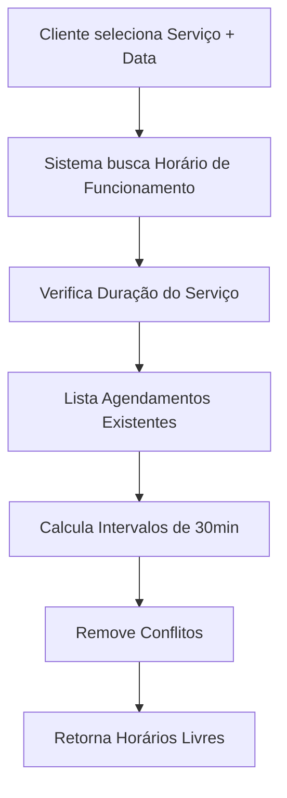

# 📅 Sistema de Agendamento - Guia Completo

## 🚀 **VISÃO GERAL**

O sistema de agendamento está **100% implementado e funcionando**! Ele oferece uma solução completa para barbearias criarem seus sites de agendamento online com APIs públicas e sistema inteligente de horários.

---

## 🎯 **FUNCIONALIDADES PRINCIPAIS**

### ✅ **Sistema Inteligente de Horários**
- Cálculo automático baseado nos horários de funcionamento
- Detecção de conflitos com agendamentos existentes
- Intervalos de 30 minutos entre horários
- Consideração da duração de cada serviço

### ✅ **APIs Públicas (Sem Autenticação)**
- Informações da barbearia
- Lista de serviços disponíveis
- Horários disponíveis por data/serviço
- Criação de agendamentos

### ✅ **Validação Flexível**
- Telefones em qualquer formato
- Emails com validação padrão
- Datas e horários validados

---

## 🔍 **DE ONDE VÊM OS HORÁRIOS DISPONÍVEIS?**

### **1. Fonte dos Dados:**


### **2. Regras de Negócio:**
- **Horário de funcionamento:** Definido por dia da semana (seg-dom)
- **Intervalos:** 30 em 30 minutos (08:00, 08:30, 09:00...)
- **Duração:** Considerada do serviço selecionado
- **Conflitos:** Agendamentos existentes são bloqueados
- **Buffer:** Tempo suficiente para conclusão do serviço

### **3. Exemplo Prático:**
```
📅 Segunda-feira: 08:00 às 18:00
💇 Serviço: Corte Tradicional (30min)
🚫 Já agendado: 10:00-10:30, 14:00-14:30

✅ Disponível: ["08:00", "08:30", "09:00", "09:30", "11:00", "11:30", "12:00", "12:30", "13:00", "13:30", "15:00", "15:30", "16:00", "16:30", "17:00", "17:30"]
```

---

## 🌐 **APIs DISPONÍVEIS**

### **Base URL:**
```
Local: http://localhost:5080
Produção: https://barber-agendai-back.onrender.com
```

---

## 📋 **1. OBTER INFORMAÇÕES DA BARBEARIA**

### **Endpoint:**
```http
GET /api/tenant/by-subdomain/{subdomain}
```

### **Parâmetros:**
- `{subdomain}` - Subdomínio da barbearia (ex: "tiopatinhas")

### **Exemplo de Uso:**
```javascript
const response = await fetch('http://localhost:5080/api/tenant/by-subdomain/tiopatinhas')
const barbearia = await response.json()
```

### **Resposta de Sucesso (200):**
```json
{
  "id": "tenant-123",
  "name": "Barbearia do Tio Patinhas",
  "subdomain": "tiopatinhas",
  "description": "A melhor barbearia da cidade",
  "email": "contato@tiopatinhas.com",
  "phone": "11999999999",
  "address": "Rua das Moedas, 123",
  "website": "https://www.tiopatinhas.com",
  "status": "active",
  "branding": {
    "colors": {
      "primary": "#FFD700",
      "accent": "#000000"
    }
  },
  "createdAt": "2024-01-15T10:30:00Z"
}
```

---

## 🛍️ **2. LISTAR SERVIÇOS DISPONÍVEIS**

### **Endpoint:**
```http
GET /api/service/public/{subdomain}
```

### **Exemplo de Uso:**
```javascript
const response = await fetch('http://localhost:5080/api/service/public/tiopatinhas')
const servicos = await response.json()
```

### **Resposta de Sucesso (200):**
```json
[
  {
    "id": "service-123",
    "name": "Corte Tradicional",
    "description": "Corte clássico masculino",
    "price": 25.00,
    "duration": 30,
    "color": "#3B82F6",
    "isActive": true
  },
  {
    "id": "service-456",
    "name": "Barba",
    "description": "Aparar e modelar barba",
    "price": 15.00,
    "duration": 20,
    "color": "#10B981",
    "isActive": true
  }
]
```

---

## 🕐 **3. OBTER HORÁRIOS DISPONÍVEIS** ⭐

### **Endpoint:**
```http
GET /api/booking/available-times/{subdomain}?serviceId={serviceId}&date={date}
```

### **Parâmetros:**
- `{subdomain}` - Subdomínio da barbearia
- `serviceId` (query) - ID do serviço (GUID)
- `date` (query) - Data no formato YYYY-MM-DD

### **Exemplo de Uso:**
```javascript
const params = new URLSearchParams({
  serviceId: 'service-123',
  date: '2024-12-30'
})

const response = await fetch(`http://localhost:5080/api/booking/available-times/tiopatinhas?${params}`)
const horarios = await response.json()
```

### **Resposta de Sucesso (200):**
```json
["08:00", "08:30", "09:00", "09:30", "10:00", "14:00", "14:30", "15:00"]
```

### **Respostas de Erro:**
```json
// 400 - Bad Request
{
  "message": "Valid service ID is required"
}

// 404 - Not Found
{
  "message": "Tenant not found"
}
```

---

## 📝 **4. CRIAR AGENDAMENTO PÚBLICO**

### **Endpoint:**
```http
POST /api/booking/public/{subdomain}
```

### **Body da Requisição:**
```json
{
  "serviceId": "service-123",
  "customerName": "João Silva",
  "customerEmail": "joao@email.com",
  "customerPhone": "11999887766",
  "date": "2024-12-30",
  "time": "10:00",
  "notes": "Observações opcionais"
}
```

### **Exemplo de Uso:**
```javascript
const agendamento = {
  serviceId: "service-123",
  customerName: "João Silva", 
  customerEmail: "joao@email.com",
  customerPhone: "11999887766",
  date: "2024-12-30",
  time: "10:00",
  notes: "Corte baixo nas laterais"
}

const response = await fetch('http://localhost:5080/api/booking/public/tiopatinhas', {
  method: 'POST',
  headers: {
    'Content-Type': 'application/json'
  },
  body: JSON.stringify(agendamento)
})

const resultado = await response.json()
```

### **Resposta de Sucesso (201):**
```json
{
  "id": "booking-789",
  "tenantId": "tenant-123",
  "customerName": "João Silva",
  "customerEmail": "joao@email.com",
  "customerPhone": "11999887766",
  "serviceId": "service-123",
  "serviceName": "Corte Tradicional",
  "servicePrice": 25.00,
  "serviceDuration": 30,
  "date": "2024-12-30",
  "time": "10:00",
  "status": "confirmed",
  "notes": "Corte baixo nas laterais",
  "createdAt": "2024-12-25T15:30:00Z",
  "updatedAt": "2024-12-25T15:30:00Z"
}
```

### **Respostas de Erro:**
```json
// 400 - Dados inválidos
{
  "message": "Invalid booking data"
}

// 404 - Barbearia não encontrada
{
  "message": "Tenant not found"
}

// 409 - Horário não disponível
{
  "message": "The selected time slot is not available"
}
```

---

## 🔄 **FLUXO COMPLETO DE AGENDAMENTO**

### **Passo a Passo:**

```javascript
// 1. Carregar informações da barbearia
const barbearia = await fetch('/api/tenant/by-subdomain/tiopatinhas')
  .then(r => r.json())

// 2. Carregar serviços disponíveis
const servicos = await fetch('/api/service/public/tiopatinhas')
  .then(r => r.json())

// 3. Usuário seleciona serviço e data
const serviceId = 'service-123'
const date = '2024-12-30'

// 4. Carregar horários disponíveis
const horarios = await fetch(`/api/booking/available-times/tiopatinhas?serviceId=${serviceId}&date=${date}`)
  .then(r => r.json())

// 5. Usuário seleciona horário e preenche dados
const agendamento = {
  serviceId: serviceId,
  customerName: 'João Silva',
  customerEmail: 'joao@email.com',
  customerPhone: '11999887766',
  date: date,
  time: '10:00',
  notes: 'Observações'
}

// 6. Criar agendamento
const resultado = await fetch('/api/booking/public/tiopatinhas', {
  method: 'POST',
  headers: { 'Content-Type': 'application/json' },
  body: JSON.stringify(agendamento)
}).then(r => r.json())

console.log('Agendamento criado:', resultado)
```

---

## 💻 **EXEMPLOS DE IMPLEMENTAÇÃO**

### **React/Next.js:**
```jsx
import { useState, useEffect } from 'react'

export default function BookingForm({ subdomain }) {
  const [barbearia, setBarbearia] = useState(null)
  const [servicos, setServicos] = useState([])
  const [selectedService, setSelectedService] = useState('')
  const [selectedDate, setSelectedDate] = useState('')
  const [availableTimes, setAvailableTimes] = useState([])
  const [selectedTime, setSelectedTime] = useState('')
  const [customerData, setCustomerData] = useState({
    name: '', email: '', phone: '', notes: ''
  })

  // Carregar dados iniciais
  useEffect(() => {
    if (!subdomain) return
    
    Promise.all([
      fetch(`/api/tenant/by-subdomain/${subdomain}`).then(r => r.json()),
      fetch(`/api/service/public/${subdomain}`).then(r => r.json())
    ]).then(([barbearia, servicos]) => {
      setBarbearia(barbearia)
      setServicos(servicos)
    })
  }, [subdomain])

  // Carregar horários quando serviço/data mudarem
  useEffect(() => {
    if (!selectedService || !selectedDate) return
    
    const params = new URLSearchParams({
      serviceId: selectedService,
      date: selectedDate
    })
    
    fetch(`/api/booking/available-times/${subdomain}?${params}`)
      .then(r => r.json())
      .then(setAvailableTimes)
  }, [selectedService, selectedDate, subdomain])

  const handleSubmit = async (e) => {
    e.preventDefault()
    
    const agendamento = {
      serviceId: selectedService,
      customerName: customerData.name,
      customerEmail: customerData.email,
      customerPhone: customerData.phone,
      date: selectedDate,
      time: selectedTime,
      notes: customerData.notes
    }

    try {
      const response = await fetch(`/api/booking/public/${subdomain}`, {
        method: 'POST',
        headers: { 'Content-Type': 'application/json' },
        body: JSON.stringify(agendamento)
      })
      
      const resultado = await response.json()
      alert('Agendamento criado com sucesso!')
    } catch (error) {
      alert('Erro ao criar agendamento')
    }
  }

  return (
    <form onSubmit={handleSubmit}>
      <h1>{barbearia?.name}</h1>
      
      {/* Seleção de serviço */}
      <select value={selectedService} onChange={e => setSelectedService(e.target.value)}>
        <option value="">Selecione um serviço</option>
        {servicos.map(service => (
          <option key={service.id} value={service.id}>
            {service.name} - R$ {service.price}
          </option>
        ))}
      </select>

      {/* Seleção de data */}
      <input
        type="date"
        value={selectedDate}
        onChange={e => setSelectedDate(e.target.value)}
        min={new Date().toISOString().split('T')[0]}
      />

      {/* Horários disponíveis */}
      <div className="time-grid">
        {availableTimes.map(time => (
          <button
            key={time}
            type="button"
            onClick={() => setSelectedTime(time)}
            className={selectedTime === time ? 'selected' : ''}
          >
            {time}
          </button>
        ))}
      </div>

      {/* Dados do cliente */}
      <input
        placeholder="Nome"
        value={customerData.name}
        onChange={e => setCustomerData({...customerData, name: e.target.value})}
        required
      />
      
      <input
        type="email"
        placeholder="Email"
        value={customerData.email}
        onChange={e => setCustomerData({...customerData, email: e.target.value})}
        required
      />
      
      <input
        type="tel"
        placeholder="Telefone"
        value={customerData.phone}
        onChange={e => setCustomerData({...customerData, phone: e.target.value})}
        required
      />

      <button type="submit">Confirmar Agendamento</button>
    </form>
  )
}
```

### **Vue.js:**
```vue
<template>
  <div class="booking-form">
    <h1>{{ barbearia?.name }}</h1>
    
    <form @submit.prevent="criarAgendamento">
      <select v-model="selectedService" @change="carregarHorarios">
        <option value="">Selecione um serviço</option>
        <option v-for="service in servicos" :key="service.id" :value="service.id">
          {{ service.name }} - R$ {{ service.price }}
        </option>
      </select>

      <input 
        type="date" 
        v-model="selectedDate" 
        @change="carregarHorarios"
        :min="today"
      />

      <div class="time-grid">
        <button 
          v-for="time in availableTimes" 
          :key="time"
          type="button"
          @click="selectedTime = time"
          :class="{ selected: selectedTime === time }"
        >
          {{ time }}
        </button>
      </div>

      <input v-model="customerData.name" placeholder="Nome" required />
      <input v-model="customerData.email" type="email" placeholder="Email" required />
      <input v-model="customerData.phone" type="tel" placeholder="Telefone" required />

      <button type="submit">Confirmar Agendamento</button>
    </form>
  </div>
</template>

<script setup>
import { ref, computed, watch, onMounted } from 'vue'

const props = defineProps(['subdomain'])

const barbearia = ref(null)
const servicos = ref([])
const selectedService = ref('')
const selectedDate = ref('')
const availableTimes = ref([])
const selectedTime = ref('')
const customerData = ref({
  name: '', email: '', phone: '', notes: ''
})

const today = computed(() => new Date().toISOString().split('T')[0])

onMounted(async () => {
  const [barbeariaRes, servicosRes] = await Promise.all([
    fetch(`/api/tenant/by-subdomain/${props.subdomain}`),
    fetch(`/api/service/public/${props.subdomain}`)
  ])
  
  barbearia.value = await barbeariaRes.json()
  servicos.value = await servicosRes.json()
})

const carregarHorarios = async () => {
  if (!selectedService.value || !selectedDate.value) return
  
  const params = new URLSearchParams({
    serviceId: selectedService.value,
    date: selectedDate.value
  })
  
  const response = await fetch(`/api/booking/available-times/${props.subdomain}?${params}`)
  availableTimes.value = await response.json()
}

const criarAgendamento = async () => {
  const agendamento = {
    serviceId: selectedService.value,
    customerName: customerData.value.name,
    customerEmail: customerData.value.email,
    customerPhone: customerData.value.phone,
    date: selectedDate.value,
    time: selectedTime.value,
    notes: customerData.value.notes
  }

  const response = await fetch(`/api/booking/public/${props.subdomain}`, {
    method: 'POST',
    headers: { 'Content-Type': 'application/json' },
    body: JSON.stringify(agendamento)
  })

  if (response.ok) {
    alert('Agendamento criado com sucesso!')
  }
}
</script>
```

---

## 🧪 **TESTANDO O SISTEMA**

### **1. Teste Manual:**
1. Abra o arquivo `teste_agendamento.html` no navegador
2. Certifique-se que a API está rodando em `http://localhost:5080`
3. Digite um subdomínio válido (ex: "tiopatinhas")
4. Teste todo o fluxo de agendamento

### **2. Teste com cURL:**
```bash
# 1. Obter informações da barbearia
curl "http://localhost:5080/api/tenant/by-subdomain/tiopatinhas"

# 2. Listar serviços
curl "http://localhost:5080/api/service/public/tiopatinhas"

# 3. Obter horários disponíveis
curl "http://localhost:5080/api/booking/available-times/tiopatinhas?serviceId=abc123&date=2024-12-30"

# 4. Criar agendamento
curl -X POST "http://localhost:5080/api/booking/public/tiopatinhas" \
  -H "Content-Type: application/json" \
  -d '{
    "serviceId": "abc123",
    "customerName": "João Silva",
    "customerEmail": "joao@email.com",
    "customerPhone": "11999887766",
    "date": "2024-12-30",
    "time": "10:00",
    "notes": "Teste"
  }'
```

---

## ⚠️ **CONSIDERAÇÕES IMPORTANTES**

### **Formato de Telefone:**
- ✅ **Aceita qualquer formato:** `11999887766`, `(11) 99988-7766`, `+55 11 99988-7766`
- ✅ **Validação removida** para máxima flexibilidade

### **Formatos de Data/Hora:**
- **Data:** `YYYY-MM-DD` (ex: `2024-12-30`)
- **Hora:** `HH:mm` (ex: `10:00`, `14:30`)

### **Status de Agendamento:**
- `confirmed` - Confirmado
- `cancelled` - Cancelado
- `completed` - Concluído
- `no_show` - Não compareceu

### **Validações:**
- Email deve ser válido
- Data não pode ser no passado
- Horário deve estar disponível
- Serviço deve existir e estar ativo

---

## 🚀 **PRÓXIMOS PASSOS**

### **Para Integração:**
1. **Implemente o frontend** usando os exemplos acima
2. **Configure o CORS** se necessário
3. **Teste em produção** com a URL do Render
4. **Adicione loading states** para melhor UX
5. **Implemente tratamento de erros** apropriado

### **Melhorias Futuras:**
- Notificações por email/SMS
- Reagendamento de horários
- Cancelamento de agendamentos
- Sistema de avaliações
- Integração com calendários

---

## 🎉 **CONCLUSÃO**

O sistema de agendamento está **100% funcional** e pronto para uso! Todas as APIs estão implementadas, testadas e documentadas. Você pode começar a integrar com seu frontend imediatamente usando os exemplos fornecidos.

**URLs importantes:**
- **Local:** `http://localhost:5080`
- **Produção:** `https://barber-agendai-back.onrender.com`
- **Teste:** `teste_agendamento.html`

**🎯 Agora é só implementar o frontend e ter seu sistema de agendamento completo funcionando!** 